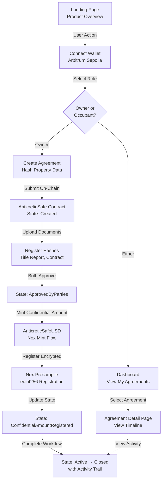
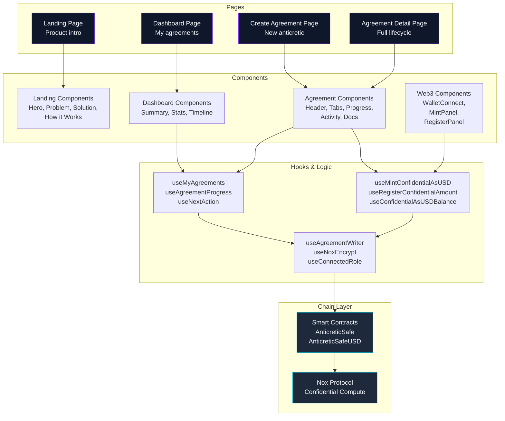
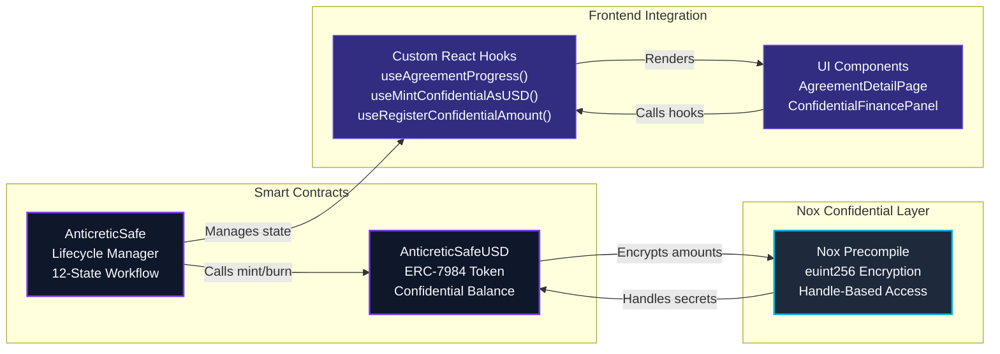
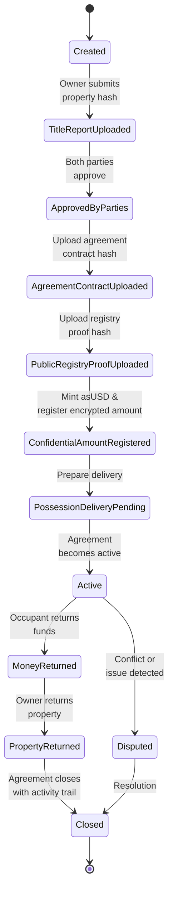
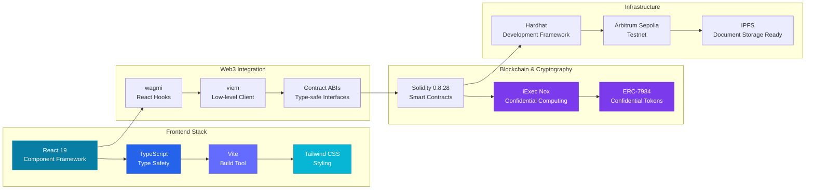
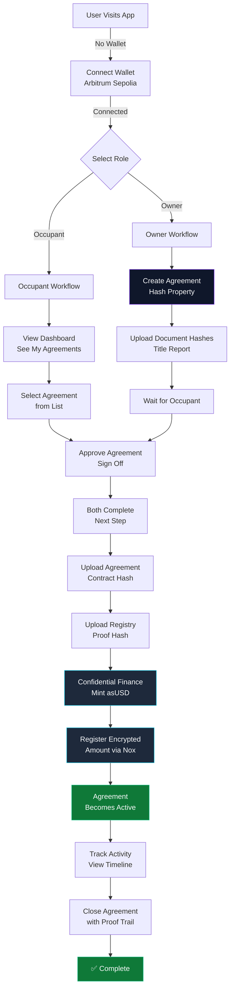

<!-- Banner -->


<!-- Badges -->
[](https://vitejs.dev/) [](https://react.dev/) [](https://www.typescriptlang.org/) [](https://tailwindcss.com/) [](https://docs.soliditylang.org/) [](https://docs.iex.ec/nox-protocol) [](https://anticreticsafe.vercel.app/)

AnticreticSafe is a confidential real-estate dApp built for the iExec Vibe Coding Challenge. It demonstrates how the Nox protocol and confidential tokens enable a full anticretic agreement workflow while keeping sensitive financial data private.

This repository is packaged as a monolithic delivery for the hackathon: UI, smart contracts, ABIs, hooks and product docs are present and ready for review.

## Quick Links

- Live demo: https://anticreticsafe.vercel.app/
- Front-end entry: https://github.com/AnticreticSafe/front-end/blob/main/src/main.tsx
- App shell: https://github.com/AnticreticSafe/front-end/blob/main/src/App.tsx
- Core pages: https://github.com/AnticreticSafe/front-end/blob/main/src/pages/LandingPage.tsx, https://github.com/AnticreticSafe/front-end/blob/main/src/pages/CreateAgreementPage.tsx, https://github.com/AnticreticSafe/front-end/blob/main/src/pages/AgreementDetailPage.tsx
- Contracts: https://github.com/AnticreticSafe/front-end/blob/main/contracts/AnticreticSafe.sol, https://github.com/AnticreticSafe/front-end/blob/main/contracts/AnticreticSafeUSD.sol
- ABIs: https://github.com/AnticreticSafe/front-end/tree/main/src/abi
- Feedback: https://github.com/AnticreticSafe/front-end/blob/main/feedback.md

## What The Product Does

AnticreticSafe models the lifecycle of an anticretic agreement, a real-estate arrangement where the occupant provides a deposit and the owner transfers temporary possession of the property.

The application lets the parties:

- create an agreement on-chain,
- hash and register sensitive property documentation,
- track the agreement state through a structured workflow,
- mint confidential asUSD for the anticretic amount,
- register and read encrypted balances through Nox-enabled flows,
- close the agreement with a complete activity trail.

## Why It Matters

Real-estate and RWA workflows often require public verifiability without exposing private terms. AnticreticSafe shows a practical way to keep addresses and contract actions transparent while protecting confidential amounts and document contents.

This makes the project a good fit for the challenge theme because it combines:

- a real use case with clear business value,
- confidential token mechanics,
- Nox encryption and handle-based flows,
- a polished front-end that can be judged quickly,
- a contract-first architecture that is easy to review.

## End-to-End Flow



1. The user lands on a product page that frames the use case and routes into the demo.
2. A dashboard summarizes agreements by role and status.
3. The owner creates a new agreement by hashing the property description and submitting the core metadata.
4. Both parties progress through the agreement lifecycle, uploading hashes for legal documents and approvals.
5. The confidential finance step mints asUSD and records the encrypted amount through the Nox flow.
6. The agreement detail view shows timeline, documents, activity, and the next action for each role.

## Main Implementation Areas



- Front-end entry points: [src/main.tsx](front-end/src/main.tsx), [src/App.tsx](front-end/src/App.tsx)
- Core pages: [LandingPage.tsx](front-end/src/pages/LandingPage.tsx), [DashboardPage.tsx](front-end/src/pages/DashboardPage.tsx), [CreateAgreementPage.tsx](front-end/src/pages/CreateAgreementPage.tsx), [AgreementDetailPage.tsx](front-end/src/pages/AgreementDetailPage.tsx)
- Web3 and confidential flows: [hooks/](front-end/src/hooks), [components/web3/](front-end/src/components/web3)
- Domain UI: [components/agreement/](front-end/src/components/agreement), [components/dashboard/](front-end/src/components/dashboard), [components/landing/](front-end/src/components/landing)
- Contracts and ABIs: [contracts/](front-end/contracts), [src/abi/](front-end/src/abi)
- Product docs: [Documents/Details.md](Documents/Details.md), [NoxDocumentation.md](front-end/src/documents/NoxDocumentation.md)

## Blockchain Architecture

### Contract Interaction Model



### Agreement State Lifecycle



### Smart Contracts

The project features two core smart contracts deployed on **Arbitrum Sepolia**:

#### 1. **AnticreticSafe.sol**
The main agreement lifecycle contract that:
- Manages the complete anticretic agreement workflow through 12 distinct states
- Stores agreement metadata (parties, property hash, document hashes)
- Handles document registration and tracking (title reports, agreements, registry proofs, etc.)
- Integrates with Nox for encrypted amount handling via `euint256`
- Emits events for state transitions and document uploads
- Provides role-based access control for owner and occupant operations

Key structures:
- `AgreementStatus` enum: 12-state lifecycle (Created → Closed/Disputed)
- `Agreement` struct: Centralized state container with all agreement data
- Support for confidential amount management via Nox precompile

#### 2. **AnticreticSafeUSD.sol**
Confidential ERC-7984 token contract that:
- Implements the ERC-7984 standard for confidential balance tracking
- Mints confidential asUSD tokens for agreement amounts
- Burns tokens when agreements close
- Uses Nox encryption primitives (`euint256`, `externalEuint256`)
- Only the contract owner (AnticreticSafe) can mint/burn
- Fully compatible with Nox confidential asset workflows

### Technical Details

- **Solidity Version**: 0.8.28 (EVM Cancun)
- **Chain**: Arbitrum Sepolia (chainId: 421614)
- **Dependencies**:
  - `@iexec-nox/nox-protocol-contracts` - Nox SDK and precompile interfaces
  - `@iexec-nox/nox-confidential-contracts` - ERC-7984 and confidential token standards
  - `@openzeppelin/contracts` (v5.6.1) - Ownable pattern and access control
- **Build Tool**: Hardhat with TypeScript
- **Testing**: Full test suite included (`npm test`)

### Deployment

Deploy to Arbitrum Sepolia:
```bash
cd Contract-Blockchain-ERC7984
npm install
npx hardhat ignition deploy ignition/modules/AnticreticSafeUSD.ts --network arbitrumSepolia
```

See [Contract-Blockchain-ERC7984/README.md](Contract-Blockchain-ERC7984/README.md) for detailed deployment instructions.

### Deployed Contracts

On Arbitrum Sepolia:
- **AnticreticSafe**: `0x40e75D0648BCB2F374dF053DeEa8A70e74699545`
- **AnticreticSafe USD (asUSD)**: `0x5e57022c7dfE939456f2aad9B11153d6beAEC06D`

## Stack



### By Layer

**Frontend**:
- React 19 - Modern component framework
- TypeScript - Full type safety
- Vite - Fast build and dev server
- Tailwind CSS - Utility-first styling
- wagmi & viem - Web3 React integration

**Blockchain & Cryptography**:
- Solidity 0.8.28 - Smart contracts
- iExec Nox - Confidential computing protocol
- ERC-7984 - Confidential token standard
- Hardhat - Development and testing framework

**Infrastructure**:
- Arbitrum Sepolia - Testnet deployment
- IPFS-ready - For document storage integration

## Notes For Judges

- The project is built around the iExec Nox confidentiality model.
- The UI is intentional and demo-friendly, but the evaluation value is in the contract flow, confidential token handling, and role-based agreement lifecycle.
- The testnet target shown in the app is Arbitrum Sepolia.
- The app reads and writes live on-chain data for the main workflow.
- See [feedback.md](front-end/feedback.md) for iExec tools usage notes and recommendations.

## User Interaction Flows



## Hackathon Compliance

- ✅ End-to-end flow without mocked data in the main path
- ✅ Live demo: https://anticreticsafe.vercel.app/
- ✅ Live contracts on Arbitrum Sepolia (see Deployed Contracts above)
- ✅ iExec tools feedback: https://github.com/AnticreticSafe/front-end/blob/main/feedback.md
- ✅ Nox protocol integration for confidential amounts and encrypted balances
- ✅ ERC-7984 confidential token implementation
- Demo video (<= 4 min): pending link

## Run Locally

From the project root:

```bash
cd front-end
npm install
npm run dev
```

## For Fast Review

If you only have a few minutes, start here:

- https://github.com/AnticreticSafe/front-end/blob/main/src/pages/LandingPage.tsx
- https://github.com/AnticreticSafe/front-end/blob/main/src/pages/CreateAgreementPage.tsx
- https://github.com/AnticreticSafe/front-end/blob/main/src/pages/AgreementDetailPage.tsx
- https://github.com/AnticreticSafe/front-end/blob/main/src/documents/NoxDocumentation.md

## Project Summary

AnticreticSafe is a confidential anticretic agreement platform for real-estate workflows on Arbitrum Sepolia. It shows how iExec Nox can be used to keep private amounts encrypted while preserving a readable, end-to-end agreement lifecycle for both parties and for judges evaluating the solution.
